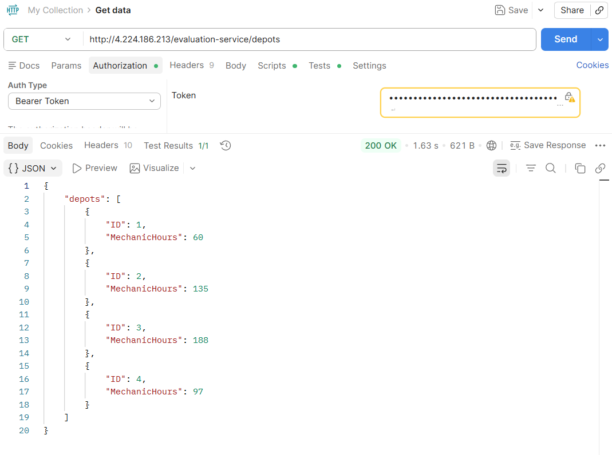
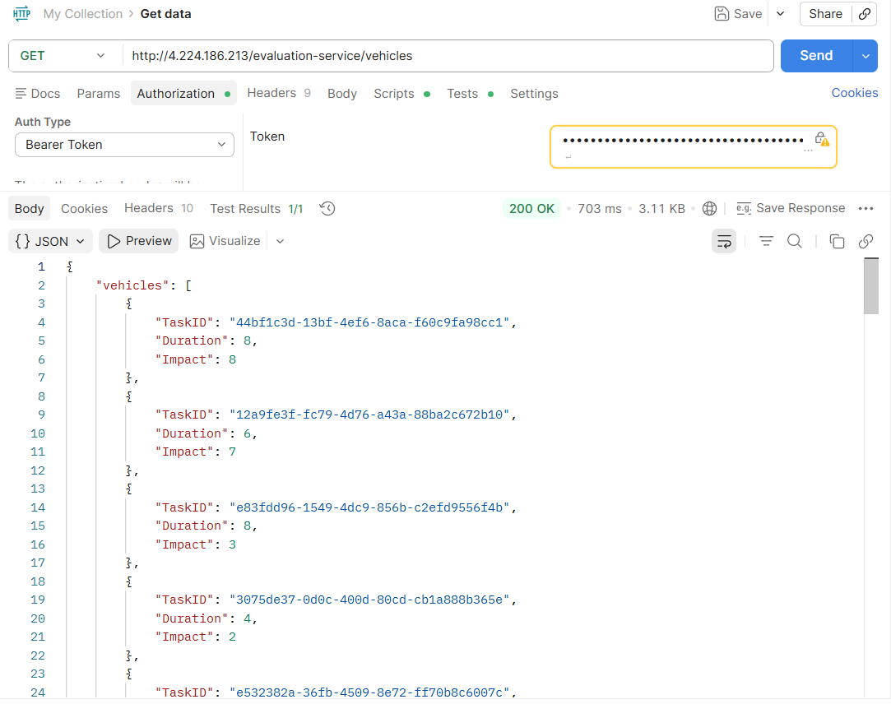
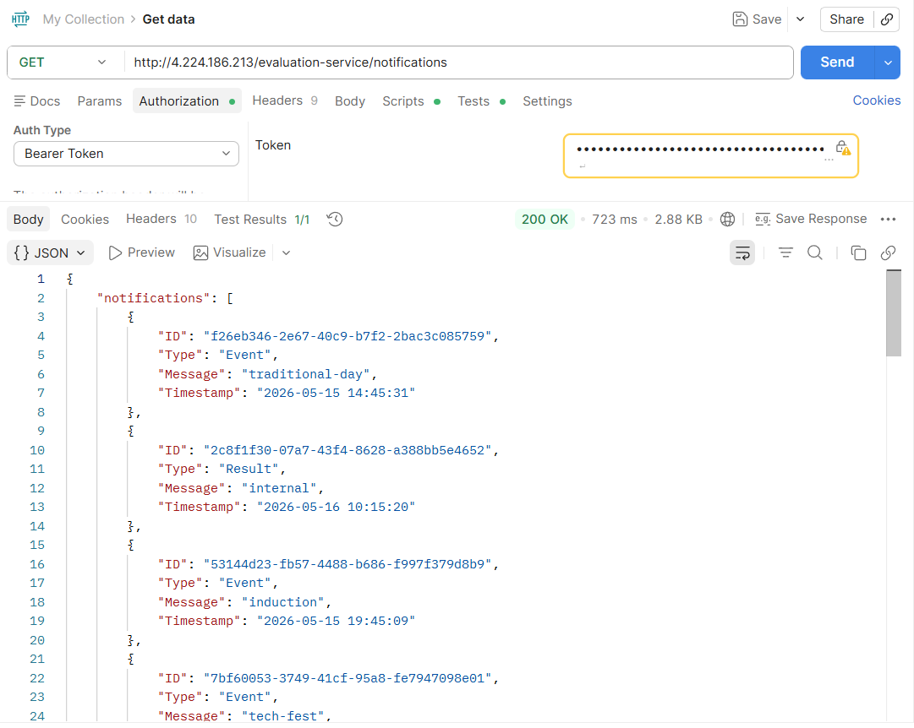
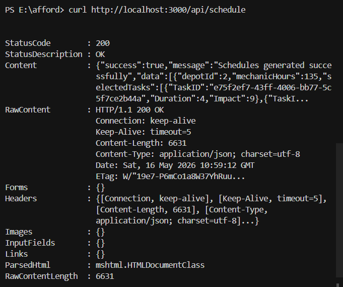
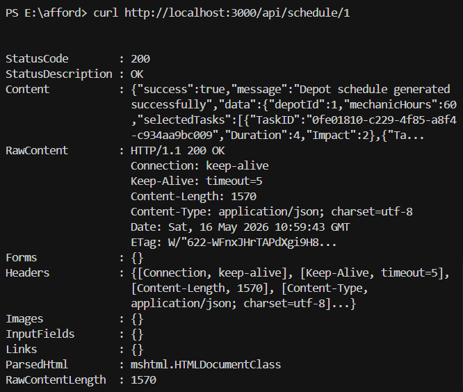
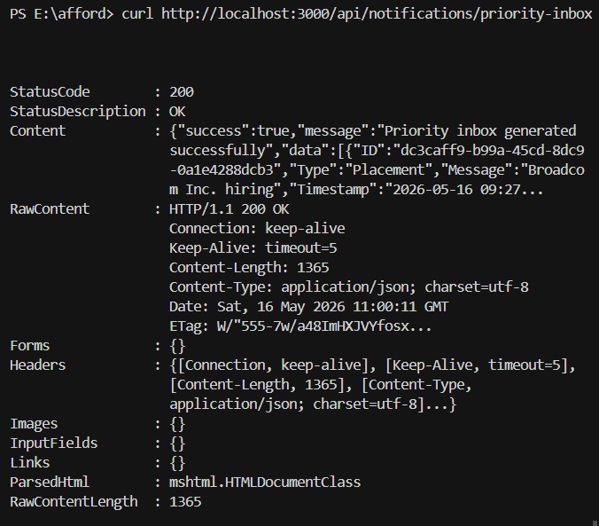

# Afford Backend Assessment

This repository contains the backend assessment solution for Afford Medical Technologies. The project implements a robust backend architecture consisting of a core scheduling service and an independent logging middleware component.

## Project Overview

The system is designed to handle complex algorithmic processing while maintaining strict integration with an external remote evaluation service. It features two primary modules:

### 1. Vehicle Maintenance Scheduler
A Node.js/Express microservice responsible for optimizing mechanic workloads.
- **Knapsack Optimization Algorithm**: Implements the 0/1 Knapsack algorithm to allocate vehicle maintenance tasks to different depots. It mathematically guarantees the maximum total impact of tasks scheduled without exceeding the available mechanic hour capacity at each depot.
- **Priority Inbox Mechanism**: Utilizes a Min-Heap data structure to efficiently parse, sort, and retrieve the top unread notifications. It enforces a strict prioritization hierarchy (Placement > Result > Event) with a secondary sort by descending timestamp.
- **Secure Integration**: Communicates securely with external, protected APIs via dynamic Bearer token generation and caching.

### 2. Remote Logging Middleware
An independent, reusable logging middleware package linked into the scheduler.
- **Asynchronous Telemetry**: Captures incoming request details, routing execution, and system errors, forwarding them asynchronously to a centralized remote logging dashboard.
- **Resilient Execution**: Designed to fail gracefully; remote logging failures will not disrupt the core business logic of the scheduler application.
- **Token Management**: Features automatic token expiration detection and refresh mechanisms to ensure uninterrupted telemetry delivery.

## Architecture and Structure

The codebase is structured to separate concerns and ensure maintainability:

```text
.
├── backend/
│   ├── logging_middleware/          # Reusable telemetry and remote logging package
│   ├── vehicle_maintenance_scheduler/ # Core Express application and algorithms
│   ├── scripts/                     # Registration and setup utilities
│   └── screenshots/                 # Execution results and API testing proofs
```

## Setup and Execution

To run the project locally, you will need Node.js installed. Follow these steps:

1. Navigate to the `backend` directory.
2. Configure your evaluation credentials in the `backend/.env` file.
3. Install dependencies and synchronize your environment by running:
   ```bash
   npm run setup
   ```
4. Start the development server:
   ```bash
   npm run dev
   ```

Detailed instructions, including manual testing guides and execution results, can be found in the [Backend Documentation](backend/README.md).

## Testing and Validation

Comprehensive manual testing has been conducted across all application surfaces:
- Authentication flows and token injection.
- Knapsack constraint validations (ensuring task durations strictly respect depot capacities).
- Priority inbox sorting accuracy and heap size limits.
- Edge case handling (e.g., malformed payloads, 404 routes, invalid depot IDs).

All execution results and screenshots are documented below:

### Protected External APIs (Manual Testing)

**1. Depots API (`GET /depots`)**  


**2. Vehicles API (`GET /vehicles`)**  


**3. Notifications API (`GET /notifications`)**  


**4. Logs API (`POST /logs`)**  


---

### Localhost Backend APIs (Manual Testing)

**1. Health Endpoint (`GET /api/health`)**  


**2. Global Schedule Optimization (`GET /api/schedule`)**  


**3. Single Depot Schedule (`GET /api/schedule/1`)**  


**4. Priority Inbox (`GET /api/notifications/priority-inbox`)**  

