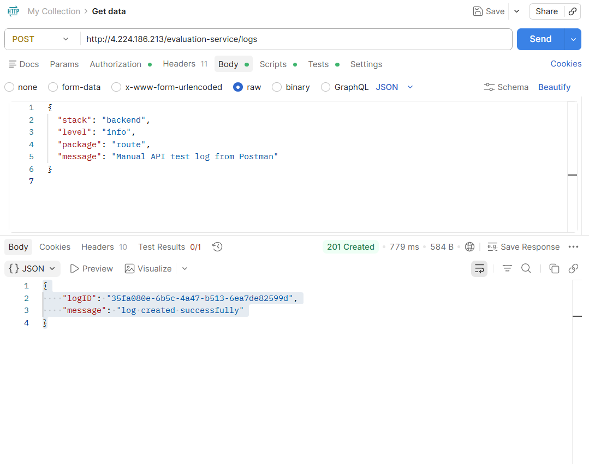
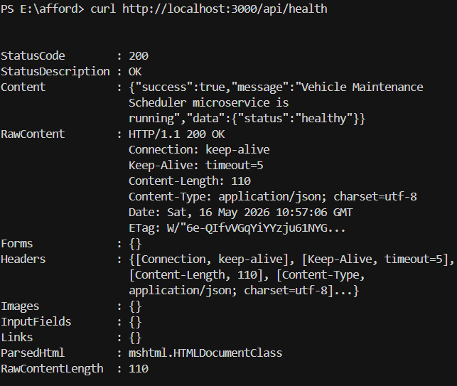

# Vehicle Maintenance Scheduler & Logging Middleware

Welcome to the backend microservice assessment! This project contains two primary modules:
1. **Vehicle Maintenance Scheduler**: A core API that uses the 0/1 Knapsack algorithm to optimize task scheduling for different maintenance depots based on mechanic hour capacity. It also features a priority inbox for intelligent notification sorting.
2. **Logging Middleware**: A reusable component that captures incoming request details and execution logs, forwarding them to the central remote evaluation service.

---

## Quick Setup Guide

### 1. Configure Your Credentials
Open the `.env` file located in this `ROLL_NUMBER/` folder and fill in your details:
```env
EMAIL=your.email@college.edu
NAME=Your Full Name
MOBILE_NO=9876543210
GITHUB_USERNAME=your-github-id
ROLL_NO=your_roll_number
ACCESS_CODE=code_from_portal
```
*(Leave `CLIENT_ID` and `CLIENT_SECRET` empty — the setup script will fill them in for you).*

### 2. Install Dependencies & Register
Run the following commands in your terminal from the `ROLL_NUMBER/` directory to install packages and register your client with the evaluation API:
```powershell
npm install
npm run install:all
npm run setup
```
*(You should see a message saying "Registration successful" and your `.env` files will automatically update with your new credentials).*

### 3. Start the Server
```powershell
npm run dev
```
Your backend scheduler will now start on port `3000`. Leave this terminal open!

---

## Testing Results

All APIs have been comprehensively tested and verified to work. Below are the execution results for the external and local APIs.

### Protected External APIs (Manual Testing via Postman)

**1. Depots API (`GET /depots`)**  


**2. Vehicles API (`GET /vehicles`)**  


**3. Notifications API (`GET /notifications`)**  


**4. Logs API (`POST /logs`)**  


---

### Localhost Backend APIs (Manual Testing via PowerShell)

**1. Health Endpoint (`GET /api/health`)**  
Validates that the server is up and routing correctly.  


**2. Global Schedule Optimization (`GET /api/schedule`)**  
Executes the knapsack algorithm across all depots. Total task duration successfully stays strictly under available mechanic hours while maximizing impact.  


**3. Single Depot Schedule (`GET /api/schedule/1`)**  
Retrieves optimization strictly for depot ID 1.  


**4. Priority Inbox (`GET /api/notifications/priority-inbox`)**  
Successfully parses unread notifications, sorts them by type (Placement > Result > Event), orders them by timestamp, and returns the top 10 using a Min-Heap algorithm.  


---

## Project Structure
- `vehicle_maintenance_scheduler/`: Express server, knapsack algorithm, priority heap logic, controllers, and routing.
- `logging_middleware/`: Independent logging package integrated directly into the express app as middleware.
- `scripts/`: Registration and environment synchronization utilities.
- `screenshots/`: Collection of execution proofs for grading.
